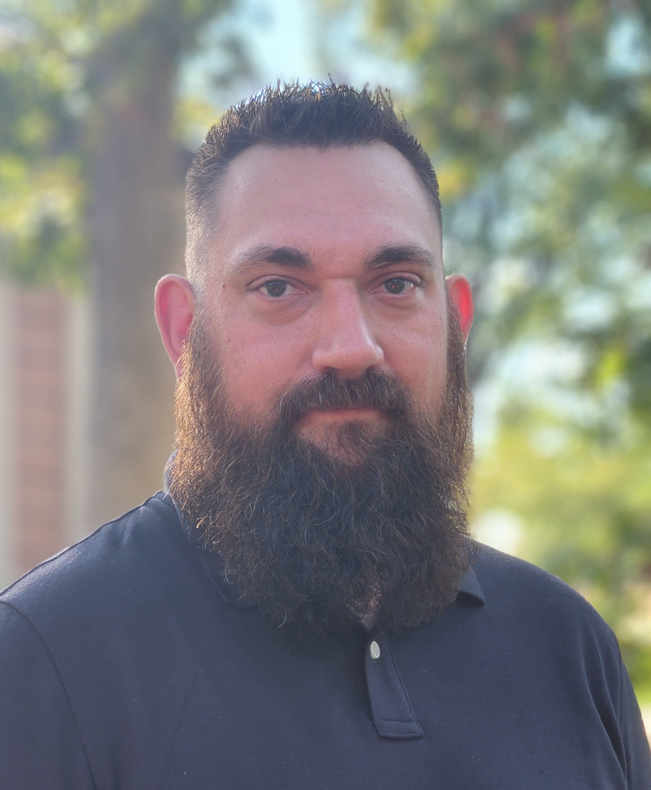

# WHOAMI
My name is Anthony Larcher-Gore. Otherwise known as Tony Gore or Nullg0re online.

I am Security Researcher for CrowdStrike and was a Security Research and Penetration Tester for Secureworks Counter Threat Unit and Secureworks Adversary Group in a previous life. I was also an avid Bug Hunter, having worked for Synack, HackerOne, BugCrowd, Intigriti, Google Cloud, and Microsoft’s bug bounty programs. I was recently announced as a 2023 and 2024 Microsoft Most Valuable Researcher (MVR) for performing Security Research within the Microsoft Ecosystem.

I have been in the industry for approximately 7 years and have earned the following certifications:

* Offensive Security:
  * OSCP
  * OSCE
  * OSWP
  * OSWE
  * OSEP
  * OSEE
eLearnSecurity
  * eJPT
  * eWAPT
  * eMAPT
  * eCPPT
* SANS GIAC
  * GSEC (expired)
  * GCIH (expired)
  * GCIA (expired)
  * GWAPT

I hold a Bachelors of Science in Computer Information Systems with a focus in Cybersecurity Programming from DeVry University and am currently working on my Masters of Science in Information Security Engineering from SANS Technology Institute.

I’m a former US Marine and served during Operation Iraqi Freedom as a Field Radio Operator and Combat Marksmanship Instructor.

I live in the Chicagoland area with my wife Amber, my three kids, and my two dogs. They are the reason why I work as hard as I do everyday, and the reason I strive to be a better person today than I was yesterday. You guys are my everything! Love you guys!

Some of my previous work can be found:

## Speaking Engagments
- 

- Secureworks 2023 Threat Intelligence Summit

- 

- 

## External Blog Postings
- 

- 

- 

- 

- 

## Open-Source Tools (Outside of Personal GitHub)
- 

- 

- 

## Published Research
- 

